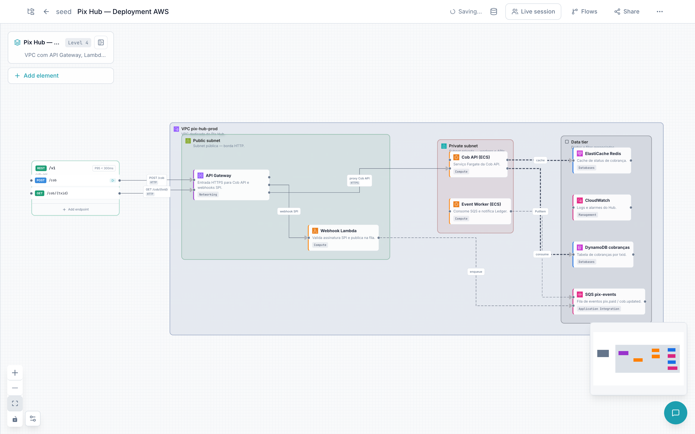
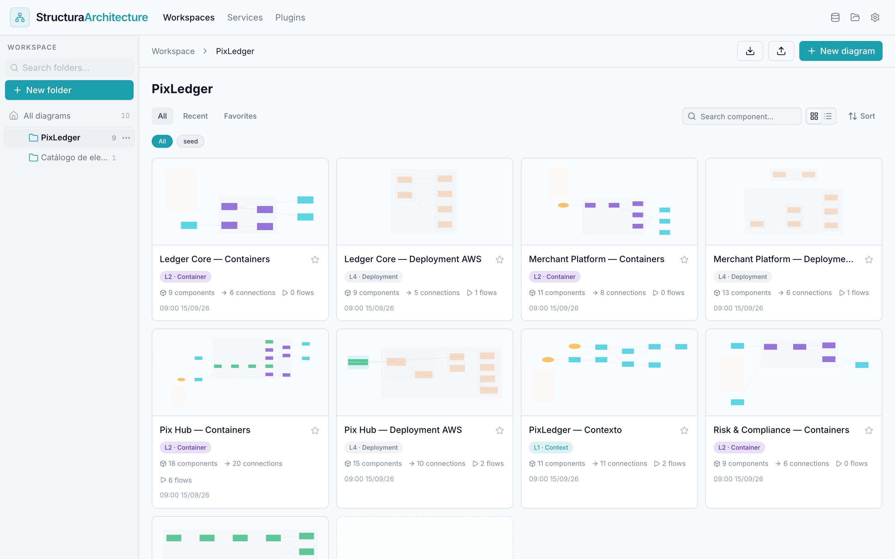
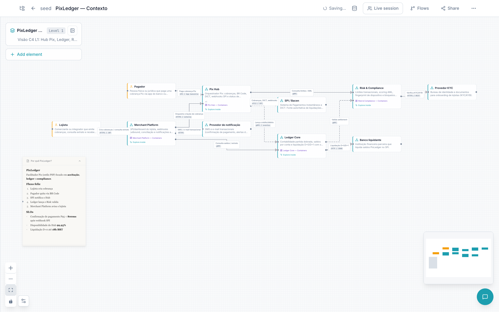
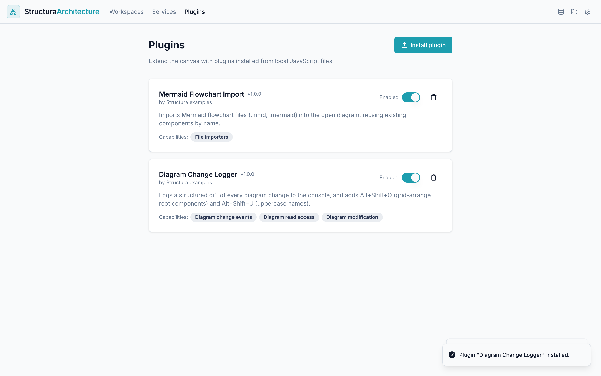
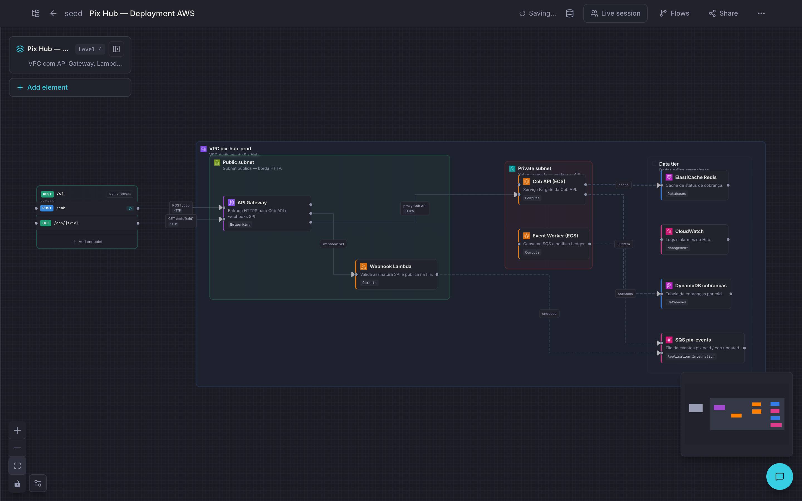

<div align="center">

# Structura

**Architecture diagrams that stay close to the system they describe.**

[](https://github.com/clarkjoao/Structura/actions/workflows/ci.yml)
[](LICENSE)
[](https://github.com/clarkjoao/Structura/tags)
[](https://structur.dev/)

[**Open the app**](https://structur.dev/) · [Documentation](docs/README.md) · [Features](docs/features.md) · [Plugins](plugins/README.md) · [Contributing](CONTRIBUTING.md)



</div>

## What is Structura?

Structura is an open source, browser-based tool for drawing and maintaining solution architecture
diagrams. It is built around the [C4 model](https://c4model.com/): you describe a system at several
levels (context, containers, components, deployment) and drill from one diagram into the next.

It is aimed at solution architects and engineering teams who want diagrams that are **modeled, not
just drawn**: elements carry types, technologies and links to real services; connections carry an
intent; and the same model can be replayed as flows, compared as versions, shared as a read-only
link or exported to other tools.

Structura is **local-first**. There is no account and no backend: your workspace lives in the
browser, and optionally in a folder on your disk that you can commit to Git.


## Features

- **C4 modeling with drill-down** — context, container, component and deployment diagrams, linked
  so you can open an element and "explore inside".
- **Cloud and infrastructure catalogs** — AWS (~140 services), Azure (~55), Google Cloud (~40),
  Kubernetes and common OSS building blocks, plus structural elements: VPC / subnet / cluster
  panels, swimlanes, notes, API groups and endpoints, database tables, JSON viewers and images.
- **Editable connections** — orthogonal and curved routing with draggable segments and waypoints,
  labels, line styles and a typed intent (call, event, data flow, async message, dependency).
- **Flows** — record a request path across the diagram, play it back step by step with branches,
  and import/export it as a Mermaid sequence diagram.
- **Versions** — keep AS-IS / TO-BE variants of a diagram and compare them.
- **Auto layout** — ELK-based layered layout (`Cmd/Ctrl + Shift + L`).
- **Services catalog** — a registry of the services behind your diagrams, linkable from elements,
  with optional GitHub and DefectDojo importers.
- **Import & export** — JSON (lossless), draw.io / diagrams.net, Mermaid; export a single diagram, a
  folder or the whole workspace as a zip.
- **Share and embed** — read-only share links and an iframe viewer for docs sites.
- **Local-first persistence** — browser storage by default; connect a local folder (File System
  Access API) to keep the workspace as files.
- **Live sessions** _(experimental)_ — real-time collaboration through a small self-hosted
  WebSocket relay ([`server/`](server/)).
- **AI assistant** — a chat grounded in the open diagram that proposes changes you review before
  they are applied. Bring your own OpenAI, Anthropic or compatible endpoint.
- **Plugins** — add node types, importers, exporters and panels from a local JavaScript file.
- **Keyboard-first** — command palette, quick insert and shortcuts for most actions; light and dark
  themes; English and Brazilian Portuguese UI.

The full list, with every shortcut, lives in [docs/features.md](docs/features.md).

<table>
  <tr>
    <td width="50%"></td>
    <td width="50%"></td>
  </tr>
  <tr>
    <td align="center">Workspace</td>
    <td align="center">C4 system context</td>
  </tr>
  <tr>
    <td width="50%"></td>
    <td width="50%"></td>
  </tr>
  <tr>
    <td align="center">Plugins</td>
    <td align="center">Dark mode</td>
  </tr>
</table>

## Quick start

The hosted app is at **[structur.dev](https://structur.dev/)** — open it and start drawing. A demo
workspace is created on first visit.

To run it locally you need **Node.js 20 or newer** (CI runs Node 20; some transitive dependencies
prefer 22+) and npm.

```bash
git clone https://github.com/clarkjoao/Structura.git
cd Structura
npm ci
npm run dev          # http://localhost:8080
```

Optional features are switched on with `VITE_*` variables; copy [`.env.example`](.env.example) to
`.env` to see them. The collaboration relay and the LLM/integration proxy live in
[`server/`](server/) and are only needed for live sessions and proxied requests:

```bash
npm run proxy        # installs and starts server/ in dev mode
```

### Useful scripts

| Command                      | What it does                                           |
| ---------------------------- | ------------------------------------------------------ |
| `npm run dev`                | Vite dev server on port 8080                           |
| `npm run build`              | Type check + production build into `dist/`             |
| `npm run typecheck`          | TypeScript gate (app + Vite config)                    |
| `npm test`                   | Unit tests (Vitest)                                    |
| `npm run lint`               | ESLint                                                 |
| `npm run format:check`       | Prettier check (`npm run format` to fix)               |
| `npm run cy:run:stress`      | Cypress canvas stress suite                            |
| `npm run plugins:sync-check` | Verifies the LeanIX plugin's generated files are fresh |
| `npm run media:capture`      | Regenerates the README screenshots and demo recording  |

## Plugins

Plugins are plain JavaScript files installed from the **Plugins** page. They run with full access
to the page (there is no sandbox), so only install plugins you trust.

- [`plugins/examples/`](plugins/examples/) — two no-build examples (a Mermaid importer and a
  diagram-change logger).
- [`plugins/structura-plugin-example-ui/`](plugins/structura-plugin-example-ui/) — a React plugin
  with toolbar, modal and settings panel.
- [`plugins/structura-plugin-leanix/`](plugins/structura-plugin-leanix/) — LeanIX integration
  (exports diagrams to LeanIX).

See [plugins/README.md](plugins/README.md) for the API and how to build and bundle plugins.

## Documentation

- [docs/README.md](docs/README.md) — map of the documentation and reading order.
- [docs/architecture/overview.md](docs/architecture/overview.md) — how the code is organized.
- [docs/adr/](docs/adr/) — architecture decision records.
- [docs/guides/](docs/guides/) — task guides (adding a node type, embedding diagrams, …).
- [AGENTS.md](AGENTS.md) — conventions and hard rules (also read by AI coding agents).

## Roadmap

Structura is pre-1.0 and moves quickly. Current focus areas are canvas performance on large
diagrams, persistence hardening, and editor/viewer parity. See [ROADMAP.md](ROADMAP.md) for the
full list and [CHANGELOG.md](CHANGELOG.md) for what already shipped.

## Contributing

Bug reports, ideas and pull requests are welcome. Start with [CONTRIBUTING.md](CONTRIBUTING.md)
(setup, conventions, how to propose a change) and follow the
[Code of Conduct](CODE_OF_CONDUCT.md). Security issues go through [SECURITY.md](SECURITY.md), not
public issues.

## License

[MIT](LICENSE) © João Luis Clark
